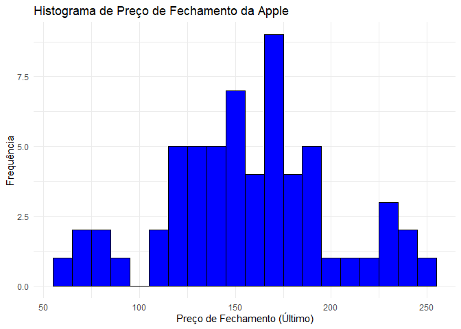
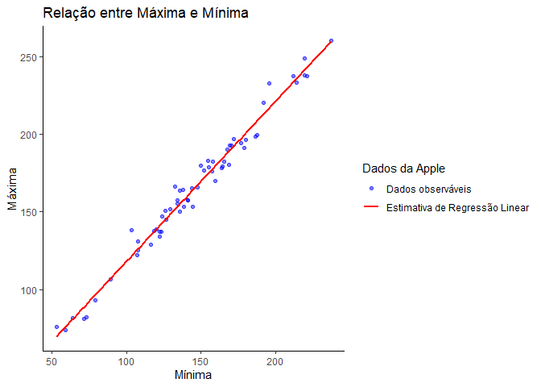

Apple
================
Matheus Gomes
2025-02-24

# Mostrar o RStudio

colnames(dados) \<- c(“Data”, “Ultimo”, “Abertura”, “Maxima”, “Minima”,
“vol”, “var”)

# Explique qual o motivo para a escolha dessa base e explique os resultados esperados através da análise.

A base de dados escolhida contém informações sobre o preço das ações da
Apple Inc. (AAPL) no período de 01/01/2020 a 01/01/2025. A escolha dessa
empresa e desse intervalo se justifica pelo fato de a Apple ser uma das
maiores companhias do mundo, altamente negociada no mercado financeiro,
além de ser uma referência no setor de tecnologia, será analisado o
preço das ações ao longo do tempo, a volatidade do ativo e a relação do
volume de negocição e a oscilação de preços.

# Carregar a base de dados

# Mostrar o RStudio

colnames(dados) \<- c(“Data”, “Ultimo”, “Abertura”, “Maxima”, “Minima”,
“vol.”, “var.”)

# Explique qual o motivo para a escolha dessa base e explique os resultados esperados através da análise.

## A base de dados escolhida contém informações sobre o preço das ações da Apple Inc. (AAPL) no período de 01/01/2020 a 01/01/2025. A escolha dessa empresa e desse intervalo se justifica pelo fato de a Apple ser uma das maiores companhias do mundo, altamente negociada no mercado financeiro, além de ser uma referência no setor de tecnologia, será analisado o preço das ações ao longo do tempo, a volatidade do ativo e a relação do volume de negocição e a oscilação de preços.

# Carregar a base de dados

``` r
dados <- read.csv("apple.csv")

# Instalar e carregar pacotes
library(tidyverse)
```

    ## ── Attaching core tidyverse packages ──────────────────────── tidyverse 2.0.0 ──
    ## ✔ dplyr     1.1.4     ✔ readr     2.1.5
    ## ✔ forcats   1.0.0     ✔ stringr   1.5.1
    ## ✔ ggplot2   3.5.1     ✔ tibble    3.2.1
    ## ✔ lubridate 1.9.4     ✔ tidyr     1.3.1
    ## ✔ purrr     1.0.4     
    ## ── Conflicts ────────────────────────────────────────── tidyverse_conflicts() ──
    ## ✖ dplyr::filter() masks stats::filter()
    ## ✖ dplyr::lag()    masks stats::lag()
    ## ℹ Use the conflicted package (<http://conflicted.r-lib.org/>) to force all conflicts to become errors

``` r
library(ggplot2)

library(summarytools)
```

    ## 
    ## Anexando pacote: 'summarytools'
    ## 
    ## O seguinte objeto é mascarado por 'package:tibble':
    ## 
    ##     view

``` r
library(tinytex)


# Outros pacotes necessários

library(lubridate)

library(pacman)
```

# Aplique uma função em R que seja útil para sua análise e mostre

Nessa parte eu fiz a correção dos dados, acertando as datas, nomes, e os
valores.

``` r
## Apliquei funções para efetuar correções como datas, e valores.

colnames(dados) <- c("Data", "Ultimo", "Abertura", "Maxima", "Minima", "Vol.", "Var.")

dados$Data <- as.Date(dados$Data, format = "%d.%m.%Y")

dados[, 2:7] <- lapply(dados[, 2:7], function(x) as.numeric(gsub(",", ".", x)))
```

    ## Warning in FUN(X[[i]], ...): NAs introduzidos por coerção
    ## Warning in FUN(X[[i]], ...): NAs introduzidos por coerção

``` r
dados$Vol. <- gsub("B", "e9", dados$Vol.)

dados$Vol. <- gsub("M", "e6", dados$Vol.)

dados$Vol. <- as.numeric(gsub(",", ".", dados$Vol.))

dados$Var. <- gsub("%", "", dados$Var.)

dados$Var. <- as.numeric(gsub(",", ".", dados$Var.)) / 100

data <- as.Date(dados$Data, format = "%Y-%m-%d")
```

# Escolher variável e fazer média,dp,quantis 25% e 75%

Fiz calculos de desvio padrão, média e quantis, com a váriavel Último da
Apple.

``` r
media_ultimo <- mean(dados$Último, na.rm = TRUE) 
```

    ## Warning in mean.default(dados$Último, na.rm = TRUE): argumento não é numérico
    ## nem lógico: retornando NA

``` r
desvio_padrao_ultimo <- sd(dados$Último, na.rm =  TRUE)

quantis_ultimo <- quantile(dados$Último, probs = c(0.25,0.75), na.rm = TRUE)

print(media_ultimo)
```

    ## [1] NA

``` r
print(desvio_padrao_ultimo)
```

    ## [1] NA

``` r
print(quantis_ultimo)
```

    ## 25% 75% 
    ##  NA  NA

# Usando a função descr

Usei o descr para avaliar as estatísticas descritivas de variáveis
numérticas e catégoricas

``` r
descr(dados)
```

    ## Warning in descr.default(dados): no non-missing arguments to numerical
    ## functions

    ## Non-numerical variable(s) ignored: Data

    ## Descriptive Statistics  
    ## dados  
    ## N: 61  
    ## 
    ##                     Abertura   Maxima   Minima   Ultimo    Var.    Vol.
    ## ----------------- ---------- -------- -------- -------- ------- -------
    ##              Mean     154.13   164.84   145.27   156.76     NaN     NaN
    ##           Std.Dev      43.00    43.31    41.52    43.37      NA      NA
    ##               Min      61.62    73.63    53.15    63.57     Inf     Inf
    ##                Q1     132.04   137.98   122.49   131.46      NA      NA
    ##            Median     155.08   165.00   143.90   157.22      NA      NA
    ##                Q3     177.83   191.05   169.11   180.75      NA      NA
    ##               Max     248.93   260.10   237.16   250.42    -Inf    -Inf
    ##               MAD      34.16    40.06    35.42    38.19      NA      NA
    ##               IQR      45.79    53.07    46.62    49.29      NA      NA
    ##                CV       0.28     0.26     0.29     0.28      NA      NA
    ##          Skewness      -0.10    -0.09    -0.07    -0.03     NaN     NaN
    ##       SE.Skewness       0.31     0.31     0.31     0.31    0.00    0.00
    ##          Kurtosis      -0.26    -0.19    -0.25    -0.30     NaN     NaN
    ##           N.Valid      61.00    61.00    61.00    61.00    0.00    0.00
    ##                 N      61.00    61.00    61.00    61.00   61.00   61.00
    ##         Pct.Valid     100.00   100.00   100.00   100.00    0.00    0.00

# Criando histograma

Usei 10 bins pois foi uma escolha mais razoável para vizualizar a
distribuição. Não se aproxima de uma distribuição normal, pois ela é
assimétrica e possui uma calda maior, isso pode indicar um outlier e uma
influência que pode mudar o preço da ação.

``` r
ggplot(data = dados, aes(x = Ultimo)) +
  geom_histogram(binwidth = 10, fill = "blue", color = "black") +
  labs(title = "Histograma de Preço de Fechamento da Apple",
       x = "Preço de Fechamento (Último)",
       y = "Frequência") +
  theme_minimal()
```

<!-- -->

# Calcular a correlação entre todas as variaveis, e mostrar as 3 váriaveis mais correlacionadas

Nessa parte calculei a correlação entre as variaveis e mostrei as 3
váriaveis que tinham mais correlação entre elas

``` r
dados_selecionados <- dados[, c("Ultimo", "Abertura", "Maxima", "Minima", "Vol.", "Var.")]

correlacao <- cor(dados_selecionados)

correlacao_df <- as.data.frame(as.table(correlacao))

correlacao_df <- correlacao_df[correlacao_df$Var1 != correlacao_df$Var2, ]

correlacao_df <- correlacao_df[order(abs(correlacao_df$Freq), decreasing = TRUE), ]

top3_pares <- correlacao_df[!duplicated(t(apply(correlacao_df[,1:2],
1, sort))),][1:3, ]

print(top3_pares)
```

    ##      Var1     Var2      Freq
    ## 16 Minima   Maxima 0.9891076
    ## 3  Maxima   Ultimo 0.9879148
    ## 9  Maxima Abertura 0.9863712

# Criar um scatterplot

``` r
ggplot(dados, aes(x = Minima, y = Maxima)) +
  geom_point(aes(color = "Pontos"), alpha = 0.5) +  
  geom_smooth(aes(color = "Regressao"), method = "lm", se = FALSE) +  
  scale_color_manual(
    name = "Dados da Apple",
    values = c("Pontos" = "blue", "Regressao" = "red"),
    labels = c("Pontos" = "Dados observáveis", "Regressao" = "Estimativa de Regressão Linear")
  ) +
  labs(
    title = "Relação entre Máxima e Mínima",
    x = "Mínima",
    y = "Máxima"
  ) +
  theme_classic()
```

    ## `geom_smooth()` using formula = 'y ~ x'

<!-- -->

# Criar um gráfico de linha.

``` r
ggplot(dados, aes(x = 1:nrow(dados))) +
  geom_line(aes(y = Maxima, color = "Máxima"), size = 1) + 
  geom_line(aes(y = Minima, color = "Mínima"), size = 1) +
  scale_color_manual(name = "Legenda", values = c("Máxima" = "blue", "Mínima" = "red")) +
  labs(title = "Comparação entre Máxima e Mínima",
       x = "Observações",
       y = "Valor") +
  theme_classic()
```

    ## Warning: Using `size` aesthetic for lines was deprecated in ggplot2 3.4.0.
    ## ℹ Please use `linewidth` instead.
    ## This warning is displayed once every 8 hours.
    ## Call `lifecycle::last_lifecycle_warnings()` to see where this warning was
    ## generated.

<!-- -->
